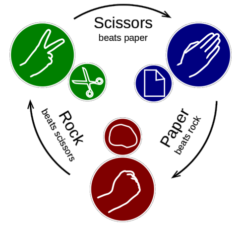

# Challenge 1 - Rock, Paper, Scissors

Rock, paper, scissors is an extremely fun game played all around the world. Tuenti employees even play it with their children after work. Have you ever played? Let's play now!



## Input

The first line will contain an integer **N**, which is the number of cases for the problem. Each case is a game between two people. It’s represented by two letters separated by a space. Each letter is the chosen shape by each player. The possible values are: **R** for rock, **P** for paper and **S** for scissors

## Output

For each case, there should be a line starting with `Case #x: ` followed by the winning shape, or `-` when the result is a draw.

## Sample Input

```
8
R S
R P
P P
S P
R R
P R
P P
S R
```

## Sample Output

```
Case #1: R
Case #2: P
Case #3: -
Case #4: S
Case #5: -
Case #6: P
Case #7: -
Case #8: R
```