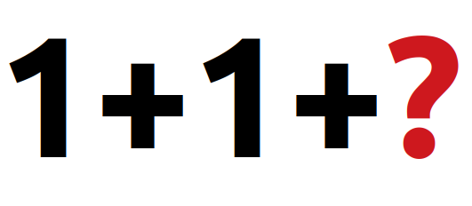

# Challenge 11 - All the Possibilities

Some people in the office are thinking about how many possible addition operations can be obtained given a positive number. Taking some considerations like `A + B = B + A` and only one of them should be summarized. Furthermore, `A > 0 && B > 0`.



## Input

On the first line, an integer **T** indicates the number of cases. Each case is described on a line with an integer **X**, which is the value to obtain, and a list of **M** positive numbers **N<sub>0</sub>**, **N<sub>1</sub>**... **N<sub>M-1</sub>** separated by an empty space. These values cannot be used to calculate the operations.

## Output

For each case **T**, the output should be the string `Case #t:` followed by the total possible operations. See the example output.

## Limits

* 1 ≤ **T** ≤ 100
* 1 ≤ **X** ≤ 100
* 0 ≤ **M** ≤ 100
* 1 ≤ **N<sub>0</sub>, N<sub>1</sub>... N<sub>M-1</sub>** < 100

## Sample Input

```
2
2 1
5 4 2
```

## Sample Output

```
Case #1: 0
Case #2: 2
```

In the first case (2), there are no way to summarize 2 without the operand 1.

The second case (5) can be calculate with the operations **1+3+1** and **1+1+1+1+1**, so there are 2 possible operations.