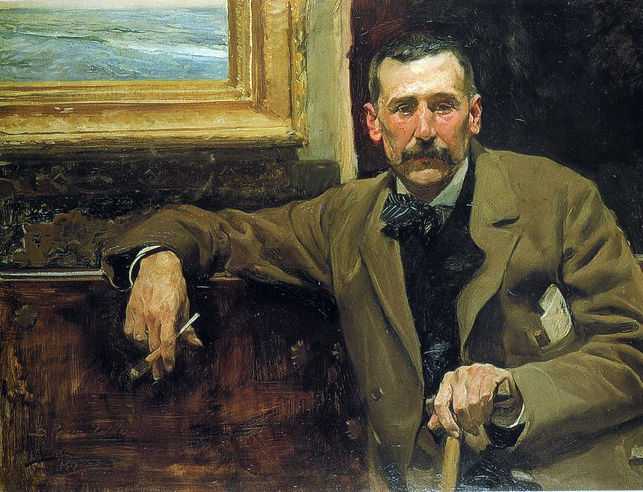

# Challenge 3 - Fortunata and Jacinta
This year is 2020 and, for the centenary of the death of the famous writer, Benito Perez Galdos, Tuenti is paying homage to the universal writer in this challenge.



We're going to analyze Galdos's masterpiece "Fortunata y Jacinta". You can find the Project Gutenberg EBook version at:

[pg17013.txt](../assets/challenge-3/pg17013.txt)

We want to count the number of instances of each word and rank all words according to a certain order.

The sort criteria will be:
1. Descending frequency. Rank #1 will be the word with the highest frequency.
2. When several words have the same frequency, UNICODE ORDER will be applied (sort by the unicode value of the char).

For example, consider the following list of words:

```
zumo ámbar doctor déjeme ejército ómnibus úlceras volveré ñoños baldomero ropa abrazo
```

The sorted order would be:

```
#1 abrazo
#2 baldomero
#3 doctor
#4 déjeme
#5 ejército
#6 ropa
#7 volveré
#8 zumo
#9 ámbar
#10 ñoños
#11 ómnibus
#12 úlceras
```

## Limits

You must follow these rules:
1. Convert all words to lowercase
2. Only consider the following letters: `a, b, c, d, e, f, g, h, i, j, k, l, m, n, ñ, o, p, q, r, s, t, u, v, w, x, y, z, á, é, í, ó, ú, ü`.  
Discard replacing with SPACE any other letter, digit or punctuation mark.  
Sample:  
        Release Date: November 5, 2005 [EBook #17013]
        [Last updated on December 21, 2019]
        Mi primer hijo--decía--nació cuando vino la tropa carlista
        «D. Plácido, ¿tiene usted pana azul?».--«¡Pana azul!
        --¿Vive aquí--le preguntó--el Sr. de Estupiñá?
        --¡Qué poca vergüenza!
        Pues apechuguemos con las _novedades_» dijo Isabel a su marido
        Barbarita declaraba riendo que con estos teje-manejes se había vuelto, sin saberlo, una doña Beatriz Galindo
        ¡Pero las niñas!... ¡Y con estas modas de ahora y este suponer!... ¿Viste la pieza de merino azul?, pues no fue bastante
Output discarding invalid characters would be:  
        release date  november          ebook
        last updated on december
        mi primer hijo  decía  nació cuando vino la tropa carlista
         d  plácido   tiene usted pana azul       pana azul
           vive aquí  le preguntó  el sr  de estupiñá
           qué poca vergüenza
         pues apechuguemos con las  novedades   dijo isabel a su marido
         barbarita declaraba riendo que con estos teje manejes se había vuelto  sin saberlo  una doña beatriz galindo
         pero las niñas      y con estas modas de ahora y este suponer      viste la pieza de merino azul   pues no fue bastante
3. According to UNICODE ORDER, valid set of characters ordered should be: `a, b, c, d, e, f, g, h, i, j, k, l, m, n, o, p, q, r, s, t, u, v, w, x, y, z, á, é, í, ñ, ó, ú, ü`
4. Discard words with fewer than three characters. Example: `y, a, o, de, el, la,...`

## Input

The first line will have an integer **N**, which is the number of cases for the problem. Each case can be a word or a number. The output depends on the input as described in the next section.

## Output

When the input is a word **W**, the number of instances of the word **W** followed by a space, the character `#` and the ranking of that word.

When the input is a number **R**, the word with ranking **R** followed by a space and the number of instances of that word.

## Sample Input

```
10
fortunata
jacinta
dios
amor
1
50
100
1000
colegio
ómnibus
```

## Sample Output

```
Case #1: 874 #27
Case #2: 576 #41
Case #3: 461 #58
Case #4: 156 #220
Case #5: que 15616
Case #6: ser 517
Case #7: alma 309
Case #8: motivo 33
Case #9: 12 #2574
Case #10: 1 #29893
```