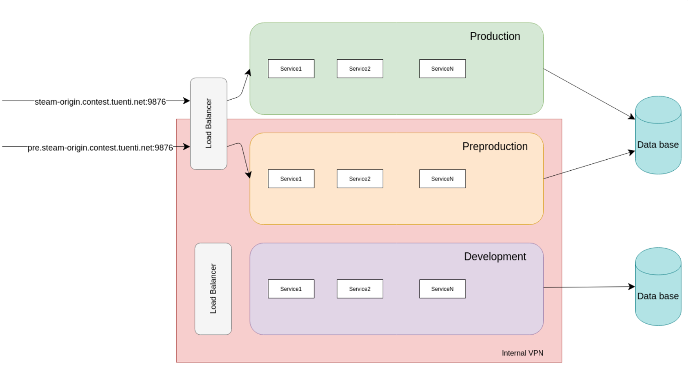

# Write-up 4 - My Favorite Video Game

The included Prezi presentation shows the following diagram:

Both production and preproduction environments share the same load balancer. In order to route traffic to one of the environment, the HTTP `Host` header is checked. A specially crafted HTTP request with a modified `Host` header is enough to reach the preproduction environment.