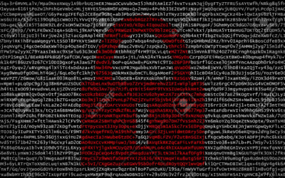

# Challenge 7 - Encrypted lines



You have encrypted lines and you have to decrypt them.

Music will make the resolution easier and much more pleasant:

[tuenti_challenge_music.ogg](../assets/challenge-7/tuenti_challenge_music.ogg)

## Input

The first line will contain an integer **N**, the number of cases for the problem. Each case is an encrypted line. Both test and submit have the same input.

## Output

**N** lines with the decrypted lines.

## Sample Input

```
2
yd. b., ,rpne ofmldrbf ,ao jrmlro.e xf abyrbcb ekrpatv
yd. ekrpat ocmlncuc.e t.fxrape ,ao lay.by.e xf agigoy ekrpat abe dco xpryd.p cb na, ,cnncam e.an.fv
```

## Sample Output

No real output is given for given sample input. Following sample output with fake phrase 'Something that makes sense' is given only to show expected output format with lines starting with `Case #N: `.

```
Case #1: Something that makes sense
Case #2: Something that makes sense
```