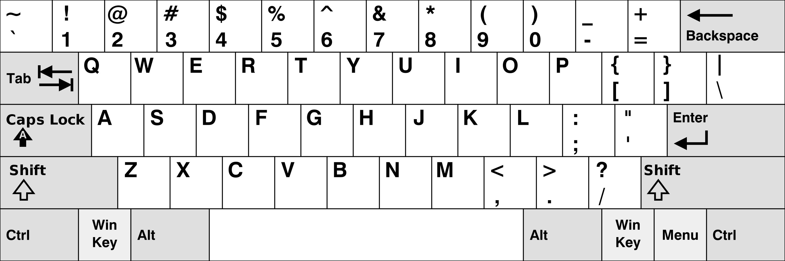
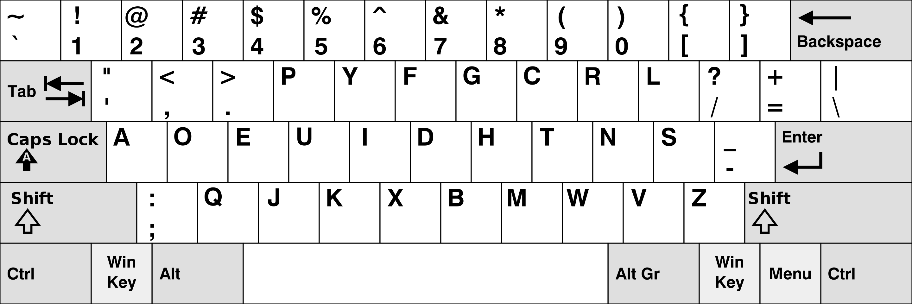

# Write-up 7 - Encrypted lines

The audio file is the hint required to solve the challenge. After some digging, the composer of the song is found: Dvořák. DVORAK is an alternative keyboard layout to QWERTY. Each key position on the keyboard maps to a different character in each layout. Replacing each character with the one in the same position of the QWERTY keyboard gives the answer.

## QWERTY

## DVORAK

